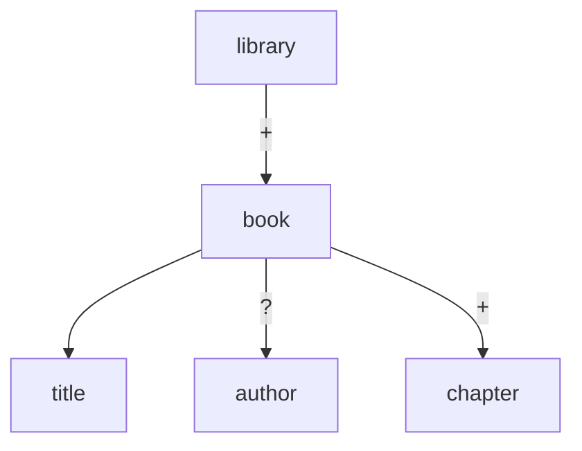

# dtd-viewer

DTDファイルの構造を可視化するCLIツール。XMLのDTD（Document Type Definition）をパースして、要素の階層構造をわかりやすく表示します。

**[English README](README.md)**

## インストール

### ワンライナー

```bash
curl -fsSL https://raw.githubusercontent.com/hoqqun/dtd-viewer/main/install.sh | bash
```

インストール先を変更する場合:

```bash
curl -fsSL https://raw.githubusercontent.com/hoqqun/dtd-viewer/main/install.sh | INSTALL_DIR=~/.local/bin bash
```

### ソースから

```bash
git clone https://github.com/hoqqun/dtd-viewer.git
cd dtd-viewer
cargo install --path .
```

## 使い方

```bash
# インタラクティブモード（デフォルト、TTY時）
dtd-viewer schema.dtd

# 静的ツリー表示（パイプ時は自動でこちら）
dtd-viewer schema.dtd --static

# JSON出力
dtd-viewer schema.dtd --json

# Mermaid図出力
dtd-viewer schema.dtd --mermaid
```

## 出力例

### --static

```
=== Entities ===
  &copyright; = "© 2024 Example Corp"
  %common;    = "(#PCDATA | em | strong)*"

=== Elements ===
library
└── book+ [@id: ID #REQUIRED, @lang: CDATA #IMPLIED]
    ├── title
    │   ├── em
    │   └── strong
    ├── author?
    └── chapter+
        ├── heading
        └── paragraph*
```

### --mermaid



### インタラクティブモード (TUI)

```
┌─ DTD Viewer ──────────────────────────────────────────┐
│                                                       │
│  ▼ library                                            │
│    ▼ book+ [@id: ID, @lang: CDATA]                    │
│        title                                          │
│        author?                                        │
│      ▶ chapter+ (3 children)                          │
│                                                       │
├───────────────────────────────────────────────────────┤
│ [↑↓] move  [Enter/→] expand  [←] collapse  [/] search│
│ [e] entities  [a] attributes  [q] quit                │
└───────────────────────────────────────────────────────┘
```

## 対応するDTD構文

- `<!ELEMENT>` — EMPTY, ANY, #PCDATA, Mixed, Children（シーケンス・選択・量指定子）
- `<!ATTLIST>` — CDATA, ID, IDREF, IDREFS, NMTOKEN, NMTOKENS, 列挙型、#REQUIRED/#IMPLIED/#FIXED/デフォルト値
- `<!ENTITY>` — 内部エンティティ、パラメータエンティティ（%name;）、外部エンティティ（SYSTEM/PUBLIC）

## 技術スタック

- Rust
- [clap](https://crates.io/crates/clap) — CLI引数パース
- [ratatui](https://crates.io/crates/ratatui) + [crossterm](https://crates.io/crates/crossterm) — TUI
- [serde](https://crates.io/crates/serde) + [serde_json](https://crates.io/crates/serde_json) — JSON出力
