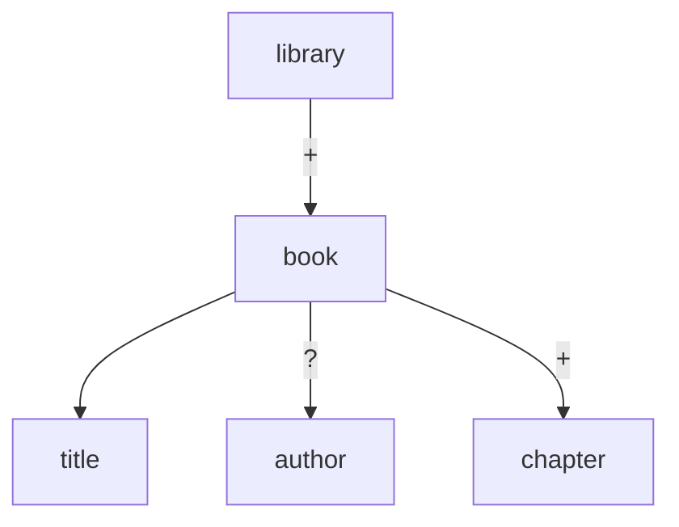

# dtd-viewer

A CLI tool to visualize DTD (Document Type Definition) file structures. Parses XML DTD files and displays element hierarchies in a readable format.

**[日本語版 README はこちら](README.ja.md)**

## Install

### One-liner

```bash
curl -fsSL https://raw.githubusercontent.com/hoqqun/dtd-viewer/main/install.sh | bash
```

To change the install directory:

```bash
curl -fsSL https://raw.githubusercontent.com/hoqqun/dtd-viewer/main/install.sh | INSTALL_DIR=~/.local/bin bash
```

### From source

```bash
git clone https://github.com/hoqqun/dtd-viewer.git
cd dtd-viewer
cargo install --path .
```

## Usage

```bash
# Interactive mode (default when TTY)
dtd-viewer schema.dtd

# Static tree output (auto-selected when piped)
dtd-viewer schema.dtd --static

# JSON output
dtd-viewer schema.dtd --json

# Mermaid diagram output
dtd-viewer schema.dtd --mermaid
```

## Output Examples

### --static

```
=== Entities ===
  &copyright; = "© 2024 Example Corp"
  %common;    = "(#PCDATA | em | strong)*"

=== Elements ===
library
└── book+ [@id: ID #REQUIRED, @lang: CDATA #IMPLIED]
    ├── title
    │   ├── em
    │   └── strong
    ├── author?
    └── chapter+
        ├── heading
        └── paragraph*
```

### --mermaid



### Interactive Mode (TUI)

```
┌─ DTD Viewer ──────────────────────────────────────────┐
│                                                       │
│  ▼ library                                            │
│    ▼ book+ [@id: ID, @lang: CDATA]                    │
│        title                                          │
│        author?                                        │
│      ▶ chapter+ (3 children)                          │
│                                                       │
├───────────────────────────────────────────────────────┤
│ [↑↓] move  [Enter/→] expand  [←] collapse  [/] search│
│ [e] entities  [a] attributes  [q] quit                │
└───────────────────────────────────────────────────────┘
```

## Supported DTD Syntax

- `<!ELEMENT>` — EMPTY, ANY, #PCDATA, Mixed, Children (sequences, choices, quantifiers)
- `<!ATTLIST>` — CDATA, ID, IDREF, IDREFS, NMTOKEN, NMTOKENS, enumeration, #REQUIRED/#IMPLIED/#FIXED/default values
- `<!ENTITY>` — Internal entities, parameter entities (%name;), external entities (SYSTEM/PUBLIC)

## Tech Stack

- Rust
- [clap](https://crates.io/crates/clap) — CLI argument parsing
- [ratatui](https://crates.io/crates/ratatui) + [crossterm](https://crates.io/crates/crossterm) — TUI
- [serde](https://crates.io/crates/serde) + [serde_json](https://crates.io/crates/serde_json) — JSON output
